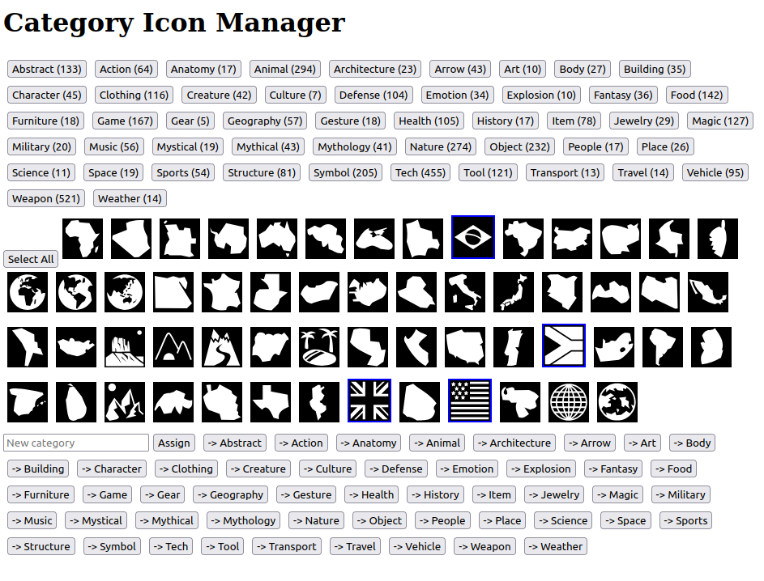

This repository contains metadata for the icons from https://github.com/game-icons/icons.

It has been asked several times on their repository if the categories and tags on https://game-icons.net are also under a free license but so far there was no answer, making them unusable in software projects. I asked in https://github.com/game-icons/icons/issues/954 for example.

We love the icon set and provide game authors an icon picker on https://virtualtabletop.io but using only the filename leaves them pretty unorganized and it's hard to find what you're looking for.

So I turned to ChatGPT, Claude and Mistral to create a baseline and a primitive editor to improve it.

Everything in this repository is public domain (CC0). Please help to improve it! But in case it isn't obvious, you **cannot** use data from https://game-icons.net to improve this data. And the icons themselves are of course **not** public domain. See https://game-icons.net/about.html.

## AI Creation

I first wrote a list of all the file names into `list.txt`. It doesn't include the latest updates from 2024.

Then I gave ChatGPT batches and asked it to prepend a category based on the filename with this prompt:

```
andymeneely/police-badge
andymeneely/riposte
aussiesim/card-10-clubs
[...]
darkzaitzev/flying-shuriken
darkzaitzev/fried-fish
darkzaitzev/hooded-assassin

---

Output the same list but prepend **each line** with a fitting category name (like
Animal, Nature, Weapon, Tech or something like that). Don't use too many different
category names. Example output:

Animal: delapouite/worms
```

The result after merging all batches can be seen in `list-categories.txt`. The format is this:

```
Tech: caro-asercion/vhs
Defense: caro-asercion/warlord-helmet
Building: caro-asercion/water-mill
```

I did a similar process for search keywords. 

```
andymeneely/police-badge
andymeneely/riposte
aussiesim/card-10-clubs
[...]
darkzaitzev/flying-shuriken
darkzaitzev/fried-fish
darkzaitzev/hooded-assassin

---

This is a list of icon filenames (author/name). I have a UI where a user can
search for an icon. Please add three alternate names to each so it's easier for a
user to find them. For example:

delapouite/feline: animal, mammal, cat
```

The result is in `list-tags.txt`:

```
lorc/spade: suit, card, shape
lorc/spanner: tool, wrench, repair
lorc/spark-spirit: energy, magic, spark
```

## Tool

With the help of Claude, I also created a primitive python web. It can be used to look at the images in a category, select any of them and assign a new category to the selected icons:



I already used it extensively to improve the initial set the AI generated.

You can start it like this:

```Shell
pip install flask flask-cors
python app.py
```

Then open http://127.0.0.1:5000/ in your browser. It will save changes to `list-categories.txt` so you can then create a pull request.

## Script for VirtualTabletop.io

The script `generate-symbols-json.py` is used to combine these three files into a `symbols.json` file as used by the VirtualTabletop.io icon picker. It also puts the index of the icon in the `list.txt` into it so it can be used to display a preview using https://game-icons.net/images/montages/game-icons.net.png (the online version probably doesn't fit the list in this repo because icons were added).

It's probably not exactly what you need for your app, but it can probably be adapted easily.